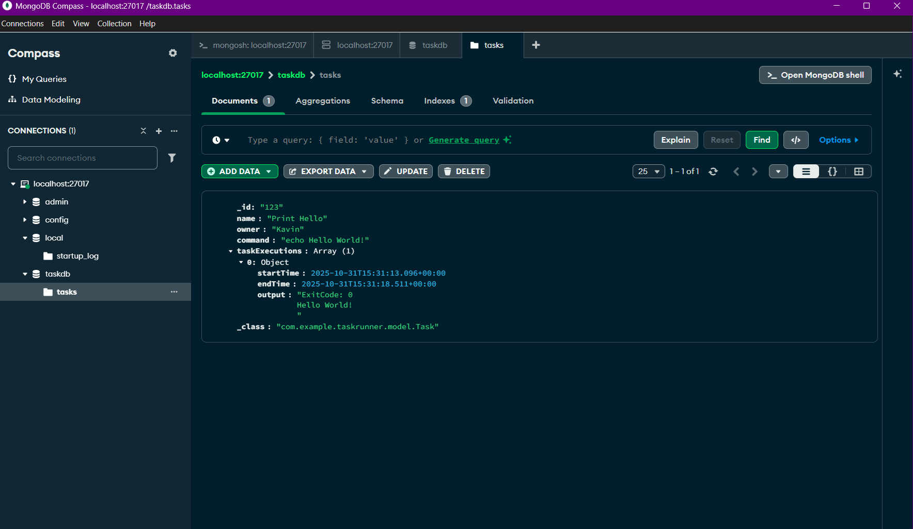

# Task 1 — Taskrunner REST API (Java + Spring Boot + MongoDB)

**Candidate:** <Kavin Kishore A>  
**Date:** <31/10/2025/9:10 PM>

---

## Overview

Simple Spring Boot REST API that stores **Task** objects in MongoDB and allows you to search, create, delete, and run them.  
Each `Task` contains:
- `id`, `name`, `owner`, `command`
- A list of `taskExecutions` showing each command run and its output.

---

## How to Run

1. **Start MongoDB**
    - Option 1:
      ```bash
      docker run -p 27017:27017 -d mongo:6
      ```
    - Option 2 (Windows service):  
      Make sure the `MongoDB` service is running.

2. **Open in IntelliJ IDEA**
    - Import as Maven project.
    - Run the `com.example.taskrunner.TaskrunnerApplication` main class.

3. **Access the API**
   Base URL → `http://localhost:8080/api/tasks`

---

## Sample cURL Requests

**PUT – Create or Update a Task**
```bash
curl -X PUT http://localhost:8080/api/tasks \
  -H "Content-Type: application/json" \
  -d '{"id":"123","name":"Print Hello","owner":"<Your Full Name>","command":"echo Hello World!"}'

---

## 📸 Screenshots (with date/time and name visible)

All screenshots are located in the `screenshots/` folder.

1. **Create task (PUT /api/tasks) response**  
   

2. **MongoDB Compass showing `tasks` collection**  
   

3. **Run task (PUT /api/tasks/{id}/run) response**  
   

4. **MongoDB Compass showing TaskExecution saved**  
   

5. **IntelliJ console showing app startup and execution logs**  
   

